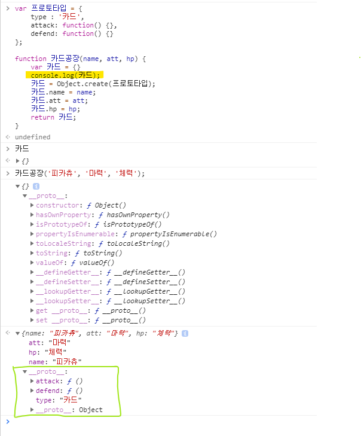
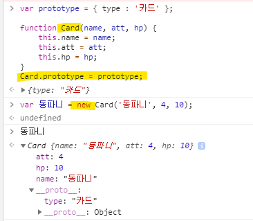
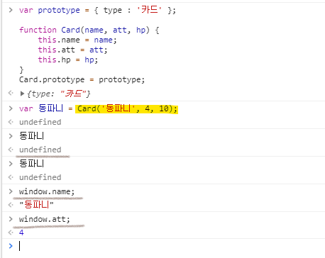

# zeroCho-Study
- 제로초님 강좌기반 자바스크립트 기초 스터디
- 유튜브 강좌

## VSCode 깃허브 레파지토리 복사하기.
1. ctrl + shift + p
2. git clone
3. repository url 입력 후 폴더 지정.
4. 스테이징 -> 커밋 -> Push


- 비동기
JS 에서 비동기란, 코드가 모두 처리되지 않은 상태에서 다음 코드를 실행하는 것을 말한다.
비동기함수를 만났을 때, 그 과정이 끝날 때까지 기다리는 것아니라 바로 다음 함수를 실행한다.

## JS 중급 - 지뢰찾기 (키워드 : 스코프, 클로저)
1. 데이터와 화면을 일치시키는게 중요. 이것이 개발하는데 굉장한 피로감을 주므로, 좋은 효율성을 위해 JS 프레임워크들이 등장하게 된 것이다.
2. e.currentTarget : 클릭이벤트의 위치를 반환함.
3. currentTarget 와 target 의 차이
    - currentTarget : 이벤트리스너를 발생시킨 대상.
    - target : 실제 이벤트가 발생한 대상.

4. 스코프와 스코프 체인
    - **스코프**란 함수, 변수, 객체의 접근 제한을 블록 단위({...}) 로 제한을 두는 것이다.

    ```
    const x = '스타벅스';

    const scope = function() {
        var x = '할리스';
        console.log(x);
    }

    scope();        // 할리스
    console.log(x); // 스타벅스
    console.log(scope.x); // undefined    
    ```
    만약, scope 함수안에 var 라는 변수선언문이 없다면, 할리스가 아닌 "스타벅스"를 호출하게 된다. <br>
    함수안에서 var, const, let 을 사용하는 순간 그 변수의 범위는 사용한 함수 블록안으로 제한된다.

5. 스코프 체인
    - **스코프 체인**이란 찾고자하는 변수가 해당 블록안에 없을 시 바로 위의 함수로 올라가 탐색하는 것을 말한다.

    ```
    const x = '스타벅스';
    const y = '빽다방';

    const scope = function() {
        const x = '할리스';

        function chain() {
            console.log(x);
        }

        chain();
        console.log(y);
    }

    scope(); // 할리스, 뺵다방
    console.log(scope.x);  // undefined
    ```
    위 처럼 찾고자하는 변수가 자신의 블록에 없으면 자신을 감싼 함수에서 그 변수를 찾는다. <br>
    '스코프 체인'은 내부에서 외부로 접근은 가능하지만, 외부에서 내부변수로는 접근이 불가능하다.

6. 클로저 : 자바스크립트는 비동기적 즉성 떄문에 반복문 안에 비동기함수를 실행하면 문제가 발생한다. 기존 문제가 되었던 코드를 먼저 살펴보자.

    - 클로저 문제 코드
    ```
    for(var i=0; i<100; i++) {
        setTimeout(function() {
            console.log(i);
        }, i*1000);
    }    
    ```
    반복문 안에 비동기 함수가 사용되었다. 비동기함수는 코드를 실행을 무시하고 실행되기 때문에 <br>
    for 문이 100을 연산하고 출력이 된다.

    - 클로저 문제 해결 코드1
    ```
    for(var i=0; i<100; i++) {
        function 클로저(j) {
            setTimeout(function() {
                console.log(j);
            }, j * 1000);
        }
        클로저(i);
    }    
    ```
    반복문 안에 일반 함수가 들어가있다. 이렇게 되버리면 '클로저' 라는 함수의 매개변수 j 는 함수 내부에 갇혀버린다. <br>

    - 클로저 문제 해결 코드2 : 즉시 실행 함수
    ```
    for(var i=0; i<100; i++) {
        (function 클로저(j) {
            setTimeout(function() {
                console.log(j);
            }, j * 1000);
        })(i);
    }    
    ```
    즉시 실행 함수를 사용해 조금 더 깔끔한 코드가 되었다. 보통은 이렇게 사용한다고 한다.


7. 재귀함수 : 함수 내에서 자기 자신을 호출하는 것. 반복문과 성격이 비슷하다.

    - 1부터 5까지 출력 -> 재귀함수
    ```
    function 재귀(num) {
        console.log(num);

        if(num === 5) {
            return;
        }
        재귀(num+1);
    }
    재귀(1);
    ```
    
    - 1부터 5까지 출력 -> for문
    ```
    for(i=1; i<=5; i++) {
        console.log(i);
    }
    ```    

### 프로토타입
자바스크립트에서 모든 객체는 prototype 을 가지고 있다. 이 prototype 을 가지고 객체들 간에 정보 공유가 가능하다.


프로토 타입이란 해당 객체가 가져야할 필수정의를 말한다.

### Call by value & Call by Reference
- 자바스크립트에는 'Call by value' 만 존재한다.
- 이 챕터는 잘 이해가 안감

### 생성자와 new


- 코드상에 에러는 없지만 생상자 함수는 함수명을 꼭 대문자로 사용하기로 암묵적인 약속이다.
- 생성자 함수를 호출할 때는 **반드시** 앞에 new 키워드를 써야한다. 
- 프로토타입을 지정한다.



- 생성자 함수를 호출할 때 new 를 사용하지 않으면 그냥 함수 호출이 되버린다.
- this 가 붙었기 때문에 name 변수는 전역변수(window) 가 되버린다.
- 그러므로 반드시 new 키워드를 붙여서 함수 스코프안에 변수를 존재하게 해야한다.


