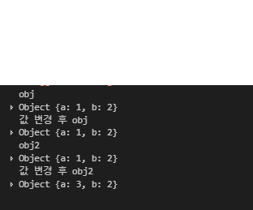
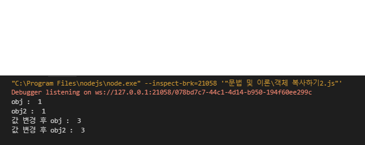

### 카드 뒤집기 게임
- 규칙
    1. 12 장의 카드가 나열된다.
    2. 2개씩 짝이 이루어진 카드 색상들이 3초 정도 보여지고 다시 뒤집힌다. (6쌍)
    3. 첫 번째 카드를 뒤집는다 -> 시간제한이 없다.
    4. 두 번째 카드를 뒤집는다. -> 첫 번째 선택한 카드와 같으면 true, 다르면 false
    5. 12장이 모두 뒤집힐 때 까지 반복한다.


### 참조와 복사
- 숫자, 문자, 불린 형태는 자료형 복사 시 값은 참조 안함 -> 사본
```
/**
 * 일반 자료형 참조 복사.
 * 
 */

// string
let 문자 = '나는 문자입니다.';
let 문자복사 = 문자;
console.log('문자 = ', 문자);
console.log('문자복사 = ', 문자복사);

// 값 변경
문자복사 = '문자값을 변경했습니다.';
console.log('문자 = ', 문자);
console.log('문자복사 = ', 문자복사);

// number
let 숫자 = '나는 숫자입니다.';
let 숫자복사 = 숫자;
console.log('숫자 = ', 숫자);
console.log('숫자복사 = ', 숫자복사);

// 값 변경
숫자복사 = '숫자값을 변경했습니다.';
console.log('숫자 = ', 숫자);
console.log('숫자복사 = ', 숫자복사);

// bool (생략)

```

- 객체 자료형 복사 시 값을 참조 -> 게임 계정을 친구에게 주는 것과 같음(나름 예시)
```
/**
 * 객체 자료형 참조 복사
 * 
 */

 // 객체 자료형 선언
 let obj = {
     'name':'땅콩',
     'age':'23'
 }

 console.log(obj);
 // 참조복사 시작
let copyObj = obj;
console.log(copyObj);

// 인스턴스에서 값 변경
copyObj.name = '빈'
copyObj.age = 30

console.log(copyObj);
console.log(obj);
```

- 객체의 복사
```
// 객체 자체를 복사하면 참조복사 되므로 객체 안의 값을 바꾸고 싶다면 원시 데이터를 바꿔야한다.

let obj = { a : 1, b : 2}

// 얕은 복사
// let obj2 = obj; 

let obj2 = {}

// 깊은 복사 (중요)
Object.keys(obj).forEach(function(key) {
        obj2[key] = obj[key]
});

console.log('obj', obj);
console.log('obj2', obj2);

obj2.a = 3;

console.log('값 변경 후 obj', obj);
console.log('값 변경 후 obj2', obj2);
```

- 결과


- 객체 복사2 
```
// Ojbect.keys 를 사용해 객체 깊은 복사를 해도, 객체 안에 또 객체가 들어가있으면 원시 복사가 안된다.

let obj = { a : 1, b : {a : 1, b : 2} }
let obj2 = {} // 자료형 복사할 객체

// 깊은 복사
Object.keys(obj).forEach(function(key) {
        obj2[key] = obj[key]
});

console.log('obj : ', obj.b['a']);
console.log('obj2 : ', obj2.b['a']);

obj2.b['a'] = 3;

console.log('값 변경 후 obj : ', obj.b['a']);
console.log('값 변경 후 obj2 : ', obj2.b['a']);

```
- 결과
